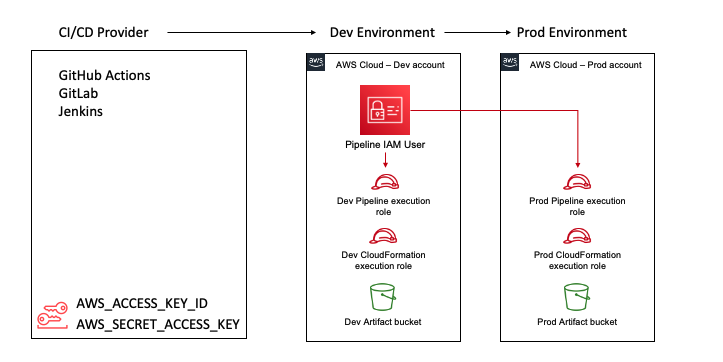
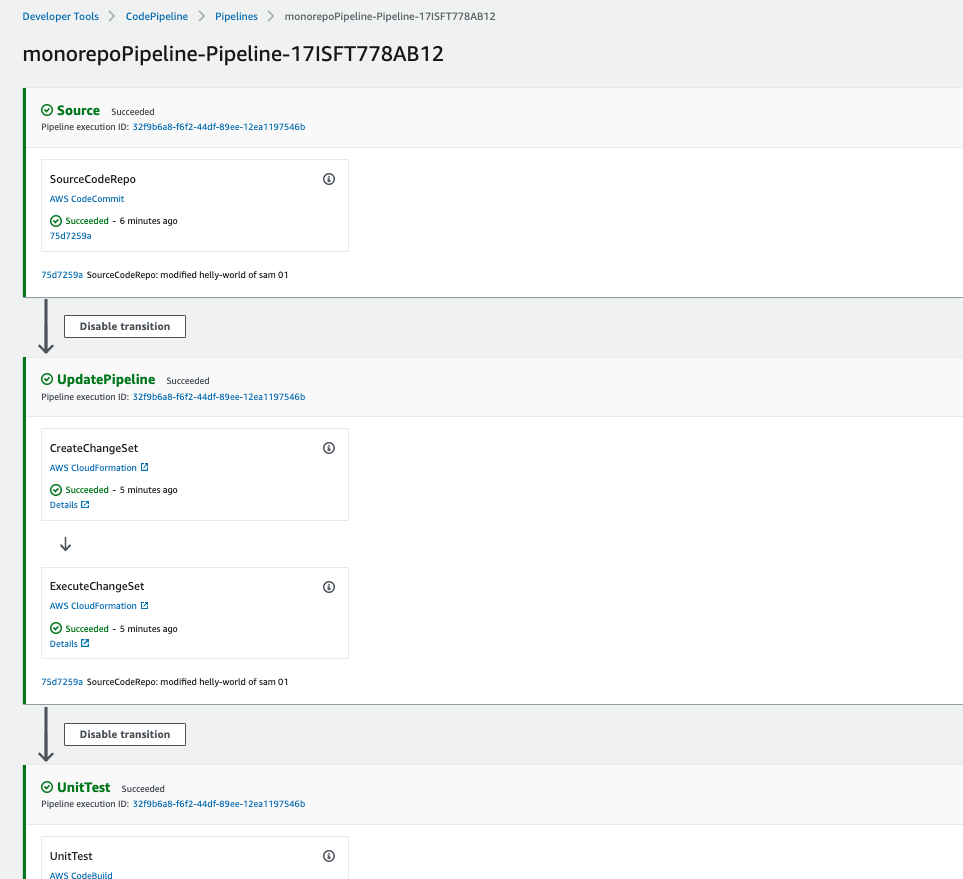
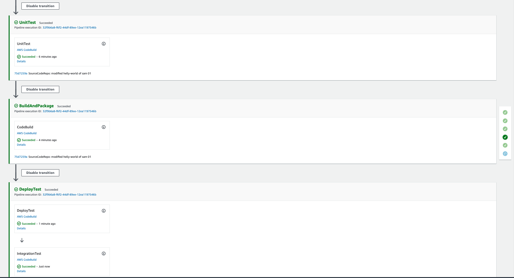
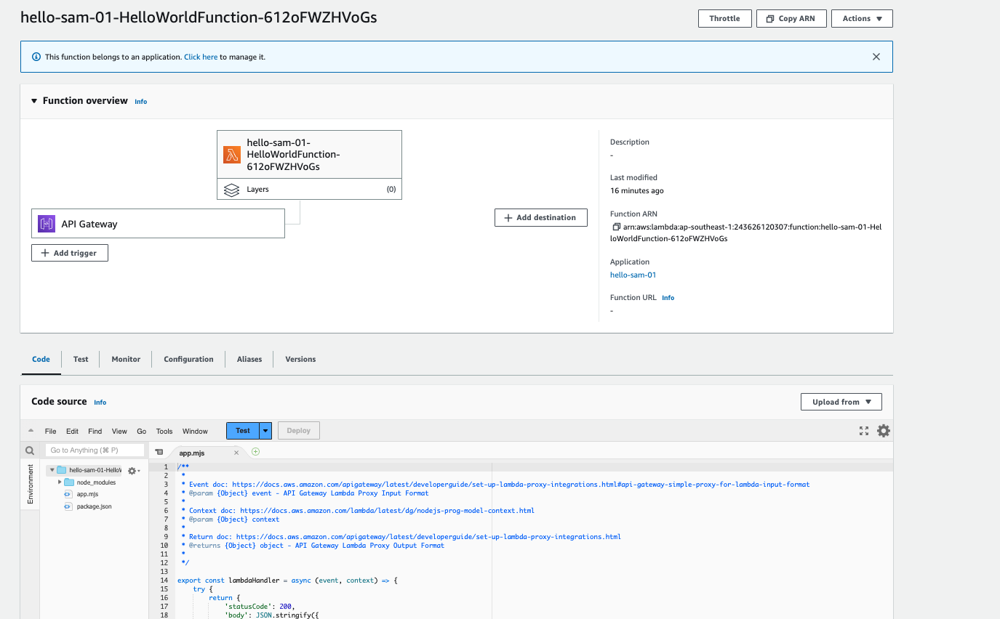

# MONOREPO CODEPIPLE WITH SAM PIPELINE AND LAMBDA

I. Flow
[Link Reference](https://aws.amazon.com/blogs/compute/introducing-aws-sam-pipelines-automatically-generate-deployment-pipelines-for-serverless-applications/)

With modification for monorepo as below:
- Using monorepo template not normal template
- Setup the sub folder for each child lambda project in the monorepo
- Using the codepipeline for each child project
- Each commit to child project -> trigger the code pipeline for that project to run and deploy on 2 accounts (test and prod account)

## I. Result

